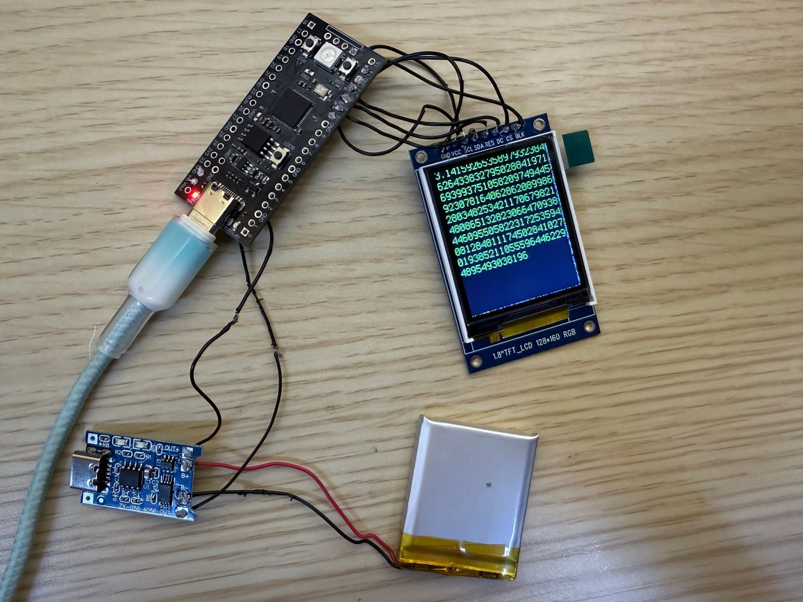
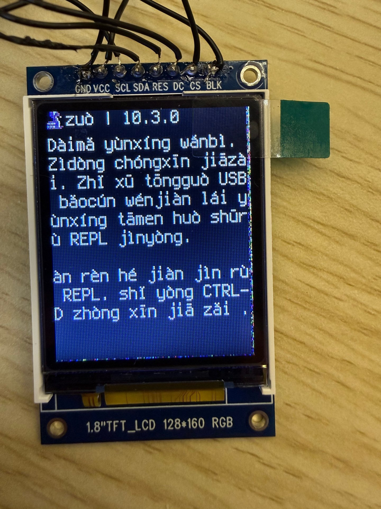
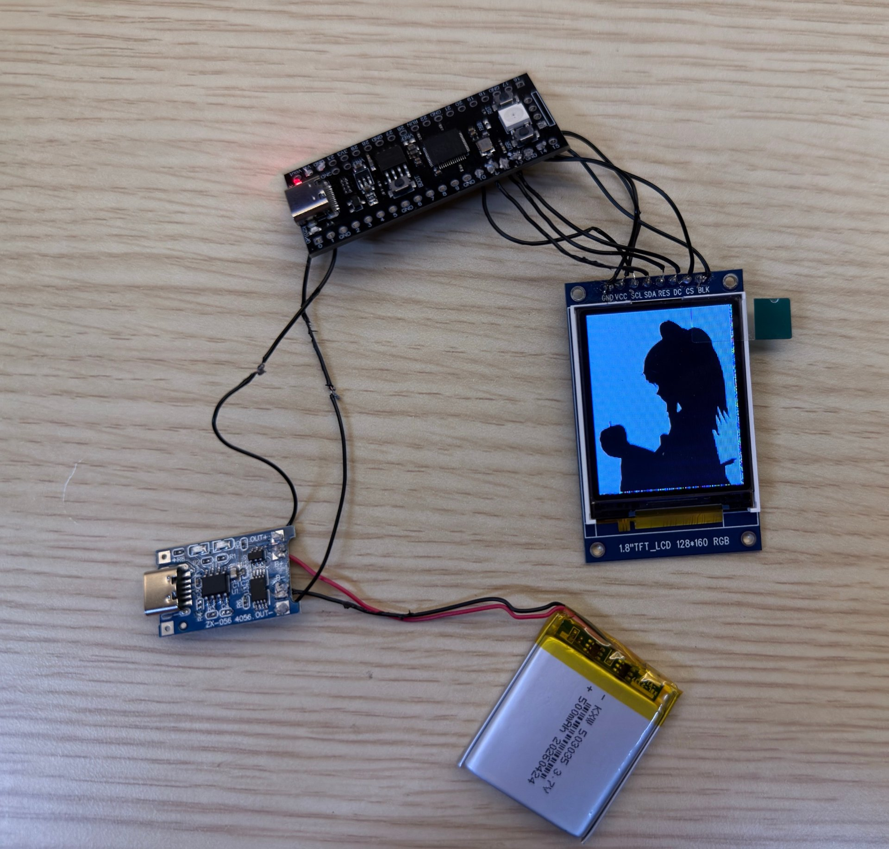

# RP2040 Mini TXT Reader

> 基于 **YD-RP2040**（16MB）微控制器与 **1.8 寸 ST7735 TFT** 屏幕的超低成本、口袋尺寸 DIY TXT 电子书阅读器，运行于 **CircuitPython 9.x**。

[](https://circuitpython.org/)
[](https://github.com/4choor3/rp2040-txt-reader)
[](LICENSE)

## 它是什么

一块板子 + 一块屏幕，做成一台火柴盒大小的「三明治」阅读器。整机物料成本 **低于 ¥30**，全部使用市面通用模块。

用法只有三步：

1. **传书**：插上 Type-C，电脑弹出一个 U 盘（`CIRCUITPY`），把 UTF-8 编码的 `book.txt` 拖进去。
2. **开机**：拨动电源开关，屏幕亮起，自动从上次位置开始显示正文。
3. **阅读**：两个物理按键翻上页 / 下页。

换书就是再拖一次文件。**无需编译器、无需 Wi-Fi、无需重新烧录**。

## ✨ 特性

- **U 盘式传书** — CircuitPython 把板载 16MB 闪存映射为 USB 磁盘，`book.txt` 直接拖入即可。
- **超低成本** — 全套物料 ¥30 以内：主控约 ¥10、屏幕约 ¥8、电池+充放电板约 ¥8、其余小件约 ¥3。
- **口袋「三明治」结构** — 屏幕 → 缓冲层 → 电池 → 主控板层叠，超薄平板形态。
- **完整中文渲染** — 像素 `.bdf` 字体 + `adafruit_bitmap_font`，彩屏当高分辨率黑白屏用。
- **电池供电** — 3.7V 锂聚合物电池 + TP4056 充放电保护板，可选拨动开关硬断电。
- **双按键翻页** — 板载上拉电阻，无需额外元件。

## 📷 实机演示

整套设备：YD-RP2040 主控 + TP4056 充放电板 + 503035 锂电池 + 1.8" ST7735 屏，运行 `examples/pi_2000.py` 滚动输出圆周率：

<p align="center">
  
</p>

CircuitPython 9.x 开机即跑，保存代码自动重载（REPL 启动信息）：

<p align="center">
  
</p>

`examples/image_viewer.py` 成品显示 BMP 图片效果：

<p align="center">
  
</p>

运行视频：

<p align="center">
  <video src="assets/demo.mp4" controls muted width="420"></video>
  <br><a href="assets/demo.mp4">▶ 视频无法播放时点此下载</a>
</p>

## 🚀 快速开始

**前提：主控板烧录好 CircuitPython 9.x 固件、依赖库齐备。** 完整步骤见 [docs/BUILD_GUIDE.zh-CN.md](docs/BUILD_GUIDE.zh-CN.md)。

1. **烧录固件**：按住 BOOT 插 Type-C → 出现 `RPI-RP2` 盘 → 拖入 `.uf2` → 自动重启为 `CIRCUITPY` 盘。
2. **装依赖库**（macOS 示例）：
   ```sh
   cp adafruit_st7735r.mpy /Volumes/CIRCUITPY/lib/
   cp -r adafruit_display_text /Volumes/CIRCUITPY/lib/
   ```
3. **放字体与小说**：`font.bdf`（中文字体）与 `book.txt`（UTF-8）拖入盘根目录。
4. **写入主程序**：把本仓库根目录的 `code.py` 复制到盘根目录，保存瞬间自动运行。

## 🧰 硬件清单

| 部件 | 型号 / 规格 | 成本 | 说明 |
|------|-------------|------|------|
| 主控板 | **YD-RP2040** 16MB 闪存版 | ¥9–11 | 53.3×22.9 mm，Type-C。务必买**未焊接排针（散件）**版。 |
| 显示屏 | **1.8 寸 TFT LCD**（ST7735） | ¥7–10 | 128×160，SPI，**8 针带 PCB 底板**模块（不要买裸屏）。 |
| 电池 | **503035** 聚合物锂电池 | ¥5–8 | 约 500–600 mAh，3.7V，扁平外形正好藏在屏幕背后。 |
| 充放电板 | **TP4056** Type-C 模块 | ¥1–2 | 充电 + 过放保护。 |
| 翻页按键 | 轻触微动开关 × 2 | <¥1 | 上页 / 下页。 |
| 电源开关 | **SS12d00** 拨动开关（可选） | <¥1 | 串联在 TP4056 与主控之间硬断电。 |
| 导线 | 30AWG 硅胶软线 | — | 狭小空间飞线。 |

## 🔌 接线方案

完整表格见 [hardware/PINOUT.md](hardware/PINOUT.md)。核心约定：

**电源链路：** 电池 → TP4056 →（拨动开关）→ YD-RP2040 Vin

| 屏幕引脚 | 主控引脚 | 功能 |
|----------|----------|------|
| VCC / BLK | **3V3** | 逻辑 + 背光供电（屏幕端并联后一根线引出） |
| GND | **GND** | 接地 |
| SCL (SCK) | **GP10** | SPI 时钟 |
| SDA (MOSI) | **GP11** | SPI 数据 |
| RES (RST) | **GP12** | 复位 |
| DC (A0) | **GP13** | 数据/命令切换 |
| CS (CE) | **GP14** | SPI 片选 |

按键：下页 **GP16** + GND，上页 **GP17** + GND（内部上拉，低电平触发）。

> **注意：** YD-RP2040 板上通常只有一个 **3V3** 孔。将屏幕的 **VCC** 与 **BLK** 在屏幕端短接并联，只引一根线到 **3V3** 即可。

## 📦 软件依赖

运行于 **CircuitPython 9.x**。`CIRCUITPY` 盘的 `lib/` 目录需要：

1. **`adafruit_st7735r.mpy`** — ST7735R 屏幕底层驱动。
2. **`adafruit_display_text/`** — 文本排版与渲染库（文件夹，不是单文件）。

中文渲染需要 **`font.bdf`**（支持中文的 `.bdf` 位图字体）放在盘根目录。

> **坑点 — CircuitPython 9.x：** `displayio.FourWire` 已独立为 `fourwire` 模块，必须 `import fourwire` + `fourwire.FourWire(...)`（8.x 旧版才是 `displayio.FourWire`）。

## 📁 项目结构

```
rp2040-txt-reader/
├── README.md                  # 本文件
├── code.py                    # 主程序：TXT 阅读器固件（CircuitPython 9.x）
├── LICENSE                    # MIT License
├── assets/                    # 实机演示图与视频
│   ├── 01-pi-demo-wiring.jpg
│   ├── 02-repl-startup.jpg
│   ├── 03-image-viewer.jpg
│   └── demo.mp4
├── docs/
│   └── BUILD_GUIDE.zh-CN.md   # 完整中文制作指南（选型→烧录→组装→排查）
├── examples/
│   ├── color_test.py          # 纯红屏硬件测试
│   ├── image_viewer.py        # 显示 /image.bmp（24 位 128x160）
│   └── pi_2000.py             # Spigot 算法滚动输出 2000 位圆周率
└── hardware/
    └── PINOUT.md              # 完整引脚接线表与磁盘目录结构
```

## 📖 项目历程

这台阅读器经历了漫长的选型与调试之路，记录在此，帮你避开重复踩过的坑。

1. **方案 A — ESP32 + TFT/OLED。** 经典路线：Arduino + `TFT_eSPI` 开发，通过 `ESP32 Sketch Data Upload` 插件或局域网网页传书。性能强，但传书依赖编译环境和 Wi-Fi。
2. **方案 B — ESP32-C3 SuperMini（约 ¥25）。** 硬币大小，自带 Wi-Fi 热点，手机连热点经网页上传 TXT。便宜无线，但仍有 Wi-Fi 和 Arduino 工具链依赖。
3. **方案 C — ESP32 16MB + I2C OLED。** 为满足「16MB + 黑白屏」需求，用 1.3 寸 OLED + `U8g2` 中文字库。对比度高，但屏幕太小、固件构建繁重。
4. **方案 D — RP2040 U 盘式（最终选定）。** 彻底抛弃 Wi-Fi。YD-RP2040 原生 USB MSC，刷入 CircuitPython 后直接变 U 盘：改代码、放 TXT 全部复制粘贴，免重新烧录。
5. **屏幕选择。** 1.8 寸 ST7735 TFT（128×160）单字成本最优。代码中文字设白（`0xFFFFFF`）、背景设黑（`0x000000`），当高分辨率单色屏用。
6. **尺寸与供电。** 53.3×22.9 mm 主控正好藏在约 56×34 mm 屏幕背后；**503035** 锂电池 + **TP4056** 充放电板提供便携供电。
7. **选型纠错。** 裸屏 FPC 排线（0.5mm 间距）手工无法焊接 → 换 **8 针带 PCB 底板**模块；要求发**未焊接排针**的 YD-RP2040，保证三明治结构足够薄。
8. **组装工艺。** 屏幕背面元件凸起 → **EVA 海绵胶贴出边缘「围墙」** + 硬塑料片防刺穿层；电烙铁 + 镊子拆排针；单 **3V3** 孔 → 屏幕端 VCC/BLK 并联。
9. **调试排障。** 背光亮但无图像 → `AttributeError: module has no attribute 'FourWire'`，改 `import fourwire` 解决（CP 9.x 变更）；缺 `adafruit_display_text` → macOS 终端 `cp -r` 解决。

## 📄 License

采用 [MIT License](LICENSE)。Copyright (c) 2026 Chen Xinyu.
